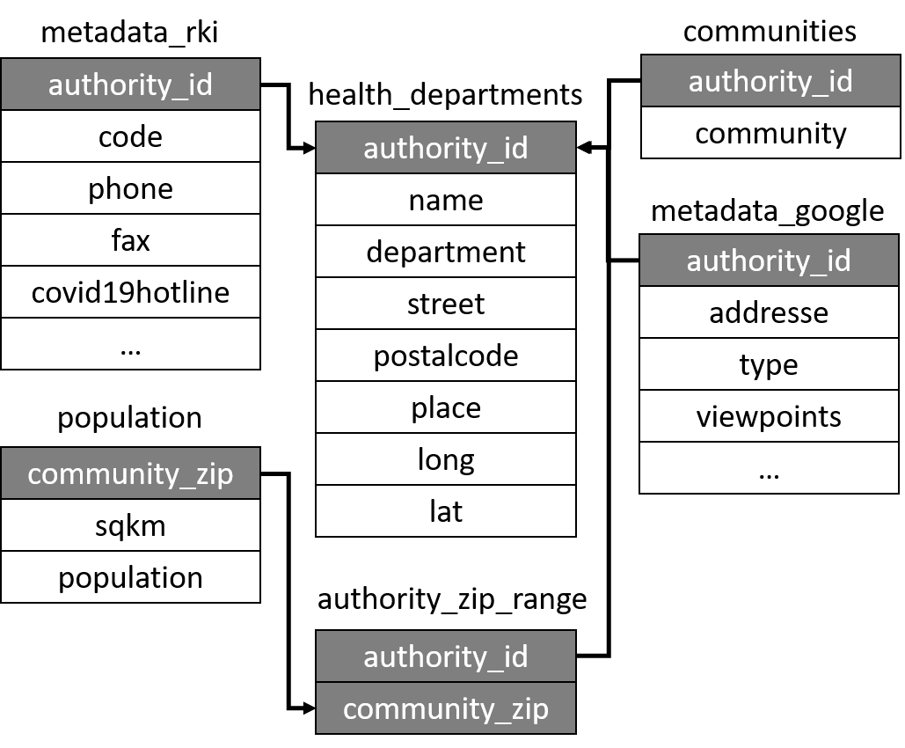

<!-- README.md is generated from README.Rmd. Please edit that file -->

```{r, include = FALSE}
knitr::opts_chunk$set(
  collapse = TRUE,
  comment = "#>",
  fig.path = "man/figures/README-",
  message = FALSE, 
  warning = FALSE,
  echo = TRUE
)
```

# gesundheitsaemter

<!-- badges: start -->
<!-- badges: end -->

The goal of `gesundheitsaemter` is to provide data sets for the analysis of German Health Authorities (Gesundheitsaemter). The package includes five different data sets collected from three different sources.

|Data set name | Content | data source URL |
|--------------|---------|-----------------|
|health_departments|General overview of German Health Authorities (Gesundheitsaemter)| [link](https://www.rki.de/DE/Content/Infekt/IfSG/Software/software_node.html)|
|authority_zip_range|All possible zip codes that are assigned to the health authority| [link](https://www.rki.de/DE/Content/Infekt/IfSG/Software/software_node.html)|
|communities|All possible community names, be reminded that one community can have several zip codes and vice versa|[link](https://www.rki.de/DE/Content/Infekt/IfSG/Software/software_node.html)|
|population_zip|Population and area assigned to every German zip code|[link](https://www.suche-postleitzahl.org)|
|metadata_rki|Contact information and further information about the health authority|[link](https://www.rki.de/DE/Content/Infekt/IfSG/Software/software_node.html)|
|metadata_google|Geo location in the health department data set is generated using the google maps api with the R package [ggmap](https://github.com/dkahle/ggmap), this file includes or meta data of this interface| [link](https://cloud.google.com/maps-platform)|


## Installation or Import

You can install the released version of `gesundheitsaemter` from [Github](https://github.com/gstephan30/gesundheitsaemter) with:

```{r eval=FALSE}
devtools::install_github("gstephan30/gesundheitsaemter")
```

For users not wanting to install the data, direct download links are:

[](./data/health_departments.csv)

```{r eval=FALSE}

```

## Merging the data

Every data set has an individual identifier for merging, this can be seen here: 

<style>
.aligncenter {
    text-align: center;
}
</style>

<p class="aligncenter">
    
</p>


## Explore Data

The primary data set with an overview of all German Health Authorities is `health_departments`:

```{r example}
library(gesundheitsaemter)
health_departments
```

With merging you can inspect the population covered by each health authority. For demonstration purposes we are just interested in health authorities of assigned to the city of Berlin.

```{r}
library(dplyr)

berlin_departments <- health_departments %>% 
  filter(place == "Berlin") %>% 
  select(authority_id, name, long, lat) %>% 
  left_join(
    authority_zip_range
  ) %>% 
  left_join(
    population_zip
  ) %>% 
  group_by(authority_id, name, long, lat) %>% 
  summarise(total_population = sum(population, na.rm = TRUE)) %>% 
  arrange(desc(total_population))

berlin_departments %>% 
  knitr::kable("html") %>% 
  kableExtra::kable_styling("striped")
```

Plotting in relation to the covered population:

```{r leaflet}
library(leaflet)

berlin_departments %>% 
  leaflet() %>% 
  addTiles() %>% 
  addCircleMarkers(
    lng = ~long, 
    lat = ~lat, 
    fill = ~total_population, 
    radius = ~total_population/10000, 
    label = ~paste0(name, ", Population: ", total_population))
```


