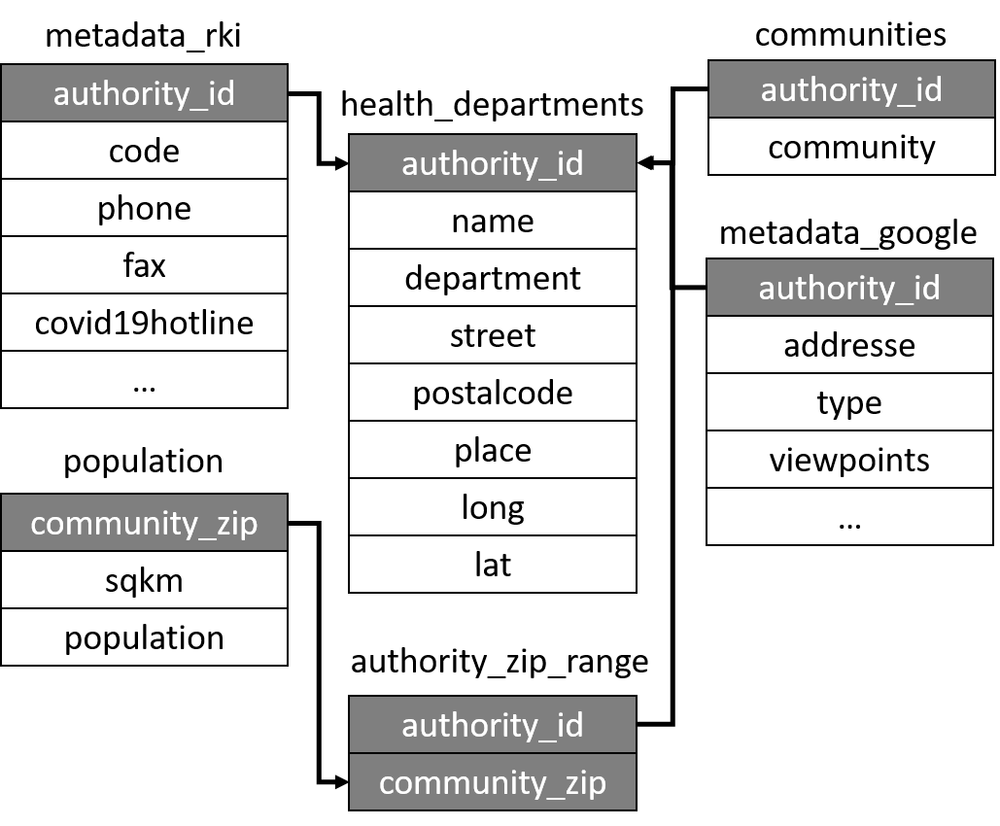
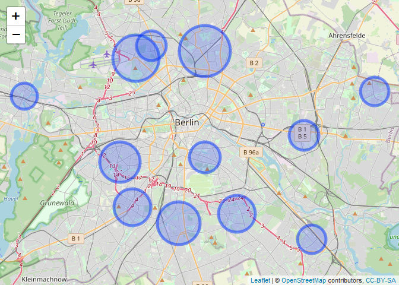

<!-- README.md is generated from README.Rmd. Please edit that file -->

# gesundheitsaemter

<!-- badges: start -->

<!-- badges: end -->

The goal of `gesundheitsaemter` is to provide data sets for the analysis
of German Health Authorities (Gesundheitsaemter). The package includes
five different data sets collected from three different sources.

| Data set name         | Content                                                                                                                                                                                              | data source URL                                                               |
| --------------------- | ---------------------------------------------------------------------------------------------------------------------------------------------------------------------------------------------------- | ----------------------------------------------------------------------------- |
| health\_departments   | General overview of German Health Authorities (Gesundheitsaemter)                                                                                                                                    | [link](https://www.rki.de/DE/Content/Infekt/IfSG/Software/software_node.html) |
| authority\_zip\_range | All possible zip codes that are assigned to the health authority                                                                                                                                     | [link](https://www.rki.de/DE/Content/Infekt/IfSG/Software/software_node.html) |
| communities           | All possible community names, be reminded that one community can have several zip codes and vice versa                                                                                               | [link](https://www.rki.de/DE/Content/Infekt/IfSG/Software/software_node.html) |
| population\_zip       | Population and area assigned to every German zip code                                                                                                                                                | [link](https://www.suche-postleitzahl.org)                                    |
| metadata\_rki         | Contact information and further information about the health authority                                                                                                                               | [link](https://www.rki.de/DE/Content/Infekt/IfSG/Software/software_node.html) |
| metadata\_google      | Geo location in the health department data set is generated using the google maps api with the R package [ggmap](https://github.com/dkahle/ggmap), this file includes or meta data of this interface | [link](https://cloud.google.com/maps-platform)                                |

## Installation or Import

You can install the released version of `gesundheitsaemter` from
[Github](https://github.com/gstephan30/gesundheitsaemter) with:

``` r
devtools::install_github("gstephan30/gesundheitsaemter")
```

For users not wanting to install the data, direct download links are:

[](./data/health_departments.csv)

## Merging the data

Every data set has an individual identifier for merging, this can be
seen here:

<style>
.aligncenter {
    text-align: center;
}
</style>

<p class="aligncenter">



</p>

## Explore Data

The primary data set with an overview of all German Health Authorities
is `health_departments`:

``` r
library(gesundheitsaemter)
health_departments
#> # A tibble: 399 x 8
#>    authority_id name      department      street    postalcode place  long   lat
#>    <chr>        <chr>     <chr>           <chr>     <chr>      <chr> <dbl> <dbl>
#>  1 1            Stadt Fl~ Fachbereich 2 ~ Norderst~ 24939      Flen~  9.43  54.8
#>  2 2            Landesha~ Amt für Gesund~ Fleethör~ 24103      Kiel  10.1   54.3
#>  3 3            Hansesta~ Gesundheitsamt  Sophiens~ 23560      Lübe~ 10.7   53.9
#>  4 4            Stadt Ne~ Gesundheitsamt  Meßtorff~ 24534      Neum~  9.99  54.1
#>  5 5            Kreis Di~ Fachdienst Ges~ Esmarchs~ 25746      Heide  9.08  54.2
#>  6 6            Kreis No~ Fachdienst Ges~ Damm 8    25813      Husum  9.05  54.5
#>  7 7            Kreis Os~ Fachdienst Ges~ Holstens~ 23701      Eutin 10.6   54.1
#>  8 8            Kreisver~ Fachdienst Ges~ Kurt-Wag~ 25337      Elms~  9.70  53.7
#>  9 9            Kreis Re~ Fachdienst 4.3~ Kaiserst~ 24768      Rend~  9.67  54.3
#> 10 10           Kreis Sc~ Fachdienst Ges~ Moltkest~ 24837      Schl~  9.56  54.5
#> # ... with 389 more rows
```

With merging you can inspect the population covered by each health
authority. For demonstration purposes we are just interested in health
authorities of assigned to the city of Berlin.

``` r
library(dplyr)

berlin_departments <- health_departments %>% 
  filter(place == "Berlin") %>% 
  select(authority_id, name, long, lat) %>% 
  left_join(
    authority_zip_range
  ) %>% 
  left_join(
    population_zip
  ) %>% 
  group_by(authority_id, name, long, lat) %>% 
  summarise(total_population = sum(population, na.rm = TRUE)) %>% 
  arrange(desc(total_population))

berlin_departments %>% 
  knitr::kable("html") %>% 
  kableExtra::kable_styling("striped")
```

<table class="table table-striped" style="margin-left: auto; margin-right: auto;">

<thead>

<tr>

<th style="text-align:left;">

authority\_id

</th>

<th style="text-align:left;">

name

</th>

<th style="text-align:right;">

long

</th>

<th style="text-align:right;">

lat

</th>

<th style="text-align:right;">

total\_population

</th>

</tr>

</thead>

<tbody>

<tr>

<td style="text-align:left;">

191

</td>

<td style="text-align:left;">

Bezirksamt Pankow von Berlin

</td>

<td style="text-align:right;">

13.40958

</td>

<td style="text-align:right;">

52.56722

</td>

<td style="text-align:right;">

427902

</td>

</tr>

<tr>

<td style="text-align:left;">

189

</td>

<td style="text-align:left;">

Bezirksamt Mitte von Berlin

</td>

<td style="text-align:right;">

13.32961

</td>

<td style="text-align:right;">

52.56222

</td>

<td style="text-align:right;">

386250

</td>

</tr>

<tr>

<td style="text-align:left;">

195

</td>

<td style="text-align:left;">

Bezirksamt Tempelhof-Schöneberg von Berlin

</td>

<td style="text-align:right;">

13.37914

</td>

<td style="text-align:right;">

52.44589

</td>

<td style="text-align:right;">

360322

</td>

</tr>

<tr>

<td style="text-align:left;">

192

</td>

<td style="text-align:left;">

Bezirksamt Charlottenburg-Wilmersdorf von Berlin

</td>

<td style="text-align:right;">

13.31146

</td>

<td style="text-align:right;">

52.48909

</td>

<td style="text-align:right;">

338414

</td>

</tr>

<tr>

<td style="text-align:left;">

196

</td>

<td style="text-align:left;">

Bezirksamt Neukölln von Berlin

</td>

<td style="text-align:right;">

13.44643

</td>

<td style="text-align:right;">

52.45255

</td>

<td style="text-align:right;">

314923

</td>

</tr>

<tr>

<td style="text-align:left;">

194

</td>

<td style="text-align:left;">

Bezirksamt Steglitz-Zehlendorf von Berlin

</td>

<td style="text-align:right;">

13.32567

</td>

<td style="text-align:right;">

52.45743

</td>

<td style="text-align:right;">

305501

</td>

</tr>

<tr>

<td style="text-align:left;">

190

</td>

<td style="text-align:left;">

Bezirksamt Friedrichshain-Kreuzberg von Berlin

</td>

<td style="text-align:right;">

13.40984

</td>

<td style="text-align:right;">

52.49247

</td>

<td style="text-align:right;">

256021

</td>

</tr>

<tr>

<td style="text-align:left;">

200

</td>

<td style="text-align:left;">

Bezirksamt Reinickendorf von Berlin

</td>

<td style="text-align:right;">

13.34767

</td>

<td style="text-align:right;">

52.57113

</td>

<td style="text-align:right;">

254399

</td>

</tr>

<tr>

<td style="text-align:left;">

199

</td>

<td style="text-align:left;">

Bezirksamt Lichtenberg von Berlin

</td>

<td style="text-align:right;">

13.52422

</td>

<td style="text-align:right;">

52.50767

</td>

<td style="text-align:right;">

252169

</td>

</tr>

<tr>

<td style="text-align:left;">

198

</td>

<td style="text-align:left;">

Bezirksamt Marzahn-Hellersdorf von Berlin

</td>

<td style="text-align:right;">

13.60615

</td>

<td style="text-align:right;">

52.53863

</td>

<td style="text-align:right;">

243939

</td>

</tr>

<tr>

<td style="text-align:left;">

197

</td>

<td style="text-align:left;">

Bezirksamt Treptow-Köpenick von Berlin

</td>

<td style="text-align:right;">

13.53302

</td>

<td style="text-align:right;">

52.43471

</td>

<td style="text-align:right;">

238613

</td>

</tr>

<tr>

<td style="text-align:left;">

193

</td>

<td style="text-align:left;">

Bezirksamt Spandau von Berlin

</td>

<td style="text-align:right;">

13.20109

</td>

<td style="text-align:right;">

52.53530

</td>

<td style="text-align:right;">

215305

</td>

</tr>

<tr>

<td style="text-align:left;">

399

</td>

<td style="text-align:left;">

Zentrum für tuberkulosekranke und -gefährdete Menschen, Berlin

</td>

<td style="text-align:right;">

13.47689

</td>

<td style="text-align:right;">

52.51557

</td>

<td style="text-align:right;">

0

</td>

</tr>

</tbody>

</table>

Plotting in relation to the covered population:

``` r
library(leaflet)

berlin_departments %>% 
  leaflet() %>% 
  addTiles() %>% 
  addCircleMarkers(
    lng = ~long, 
    lat = ~lat, 
    fill = ~total_population, 
    radius = ~total_population/10000, 
    label = ~paste0(name, ", Population: ", total_population))
```

<!-- -->
